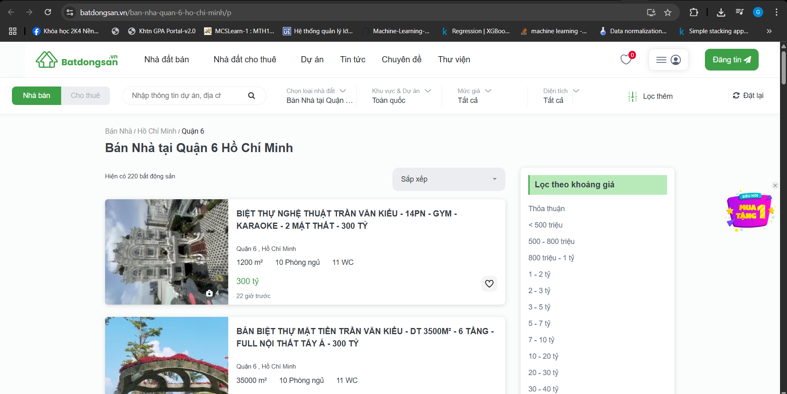

# 🏠 House Price Prediction



Dự án dự đoán giá nhà tại TP.HCM dựa trên dữ liệu được crawl từ [batdongsan.vn](https://batdongsan.vn/) và sử dụng Large Language Model để trích xuất các đặc trưng từ mô tả. Repo bao gồm toàn bộ mã nguồn, notebook phân tích và dữ liệu.

---

## 📁 Cấu trúc thư mục

.
├── Báo_cáo_Đồ_án_NMKHDL.pdf          # Báo cáo chi tiết
├── Crawling.ipynb                    # Thu thập dữ liệu từ web
├── Data.zip                          # Dữ liệu thô và đã xử lý
├── Ghep_data.ipynb                   # Gộp dữ liệu từ nhiều nguồn
├── LLM.ipynb                        # Trích xuất đặc trưng bằng LLM
├── Methodology.ipynb                 # Đánh giá và huấn luyện mô hình
├── Preprocessing_and_FeatureEngineering.ipynb  # Tiền xử lý dữ liệu
├── data_crawl.csv                    # Dữ liệu thô sau khi crawl
├── data_final.csv                    # Dữ liệu đã xử lý hoàn chỉnh
├── data_hcm_llm.csv                  # Dữ liệu từ LLM
├── requirements.txt                  # Thư viện cần thiết
└── website.png                       # Ảnh minh họa

yaml
Sao chép
Chỉnh sửa

---

## 🚀 Bắt đầu

### Yêu cầu
- Python >= 3.8
- Jupyter Notebook

### Cài đặt
```bash
# Clone repo
git clone https://github.com/rewritethemoon/House-Prediction.git
cd House-Prediction

# (Tùy chọn) tạo môi trường ảo
python -m venv venv
source venv/bin/activate     # Windows: venv\\Scripts\\activate

# Cài đặt thư viện
pip install -r requirements.txt
🧾 Quy trình dự án
1. Thu thập dữ liệu
Crawl từ https://batdongsan.vn/ với script trong Crawling.ipynb.

Dữ liệu gồm giá, số phòng, địa chỉ, mô tả,...

2. Trích xuất đặc trưng
Dùng LLM.ipynb để lấy chiều rộng, chiều dài, số tầng từ mô tả.

Gộp lại toàn bộ thông tin trong Ghep_data.ipynb.

3. Xử lý và tạo đặc trưng
Xử lý đơn vị giá bất thường (vd: 500 triệu tỷ).

Dọn dẹp, chuyển đổi và xử lý missing value.

Tạo thêm đặc trưng mới: tổng diện tích, có mặt tiền,...

Notebook chính: Preprocessing_and_FeatureEngineering.ipynb.

4. Huấn luyện mô hình
Thử nghiệm mô hình Linear Regression và Gradient Boosting.

Đánh giá theo R², RMSE,...

Chi tiết tại Methodology.ipynb.
